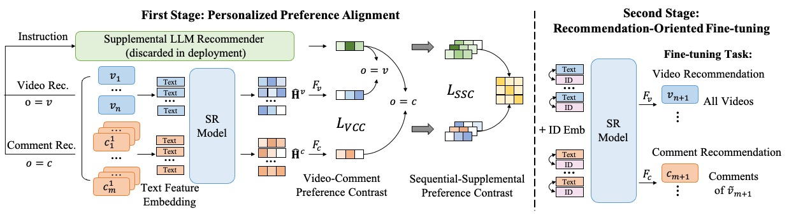

# LSVCR

This is the official PyTorch implementation for the paper:

> A Large Language Model Enhanced Sequential Recommender for Joint Video and Comment Recommendation

## Overview

In this paper, we propose a novel recommendation approach called **LSVCR** by leveraging user interaction histories with both videos and comments, so as to jointly conduct personalized video and comment recommendation. Specifically, our approach consists of two key components, namely the sequential recommendation (SR) model and the supplemental LLM recommender. Firstly, we adopt the SR model as the recommendation backbone of our approach for relatively efficient user preference modeling. Secondly, drawing inspiration from the great potential of large language models~(LLMs) in recommender systems, we leverage LLM as a supplemental recommender (discarded in deployment) to better capture underlying user preferences from heterogeneous interaction behaviors. Finally, we design a two-stage training paradigm to integrate the merits of the SR model and the LLM module. The first stage is personalized preference alignment, which aims to align the preference representations from both components, thereby enhancing the semantics of the SR model. The second stage is recommendation-oriented fine-tuning, in which the alignment-enhanced SR model is fine-tuned according to the specific objective to further improve the recommendation performance. 



## Requirements

```
torch==2.0+cu117
transformers
accelerate
deepspeed
peft
sentencepiece
tqdm
```

## Dataset

Due to the privacy policy of KuaiShou, the dataset is temporarily unavailable to the public. But we are working on data desensitization in the hope that the entire dataset will be made public in the near future.

## Personalized Preference Alignment

The detailed scripts for alignment training are in `run_lora.sh`:

```shell
export WANDB_MODE=disabled
export CUDA_LAUNCH_BLOCKING=1
export DISABLE_MLFLOW_INTEGRATION=TRUE
export TORCH_DISTRIBUTED_DEBUG=DETAIL

NUM_GPUS=8
MASTER_PORT=13324
LR=3e-4
SEED=2024
EPOCHS=1
DEV_BATCH_SIZE=2
GRAD_ACCUMULARION_STEPS=8
NUM_WORKERS=12

WARMUP=0.03
WEIGHT_DECAY=0.0
STRATEGY=steps
SAVE_EVAL_STEPS=1000
DEEPSPEED=./config/ds_z2_bf16.json
GRAD_CKPT=True

BASE_MODEL_PATH=/THUDM/chatglm3-6b/
DATASET_PATH=./data/

RUN_NAME=LSVCR
DATESTR=`date +%Y%m%d-%H%M%S`
OUTPUT_DIR=./ckpt/${RUN_NAME}-${DATESTR}-${LR}

torchrun --nproc_per_node=$NUM_GPUS --master_port=$MASTER_PORT train.py \
    --seed $SEED \
    --model_name_or_path $BASE_MODEL_PATH \
    --output_dir $OUTPUT_DIR \
    --data_path $DATASET_PATH \
    --per_device_train_batch_size $DEV_BATCH_SIZE \
    --per_device_eval_batch_size $DEV_BATCH_SIZE \
    --dataloader_num_workers $NUM_WORKERS \
    --gradient_accumulation_steps $GRAD_ACCUMULARION_STEPS \
    --gradient_checkpointing $GRAD_CKPT \
    --learning_rate $LR \
    --num_train_epochs $EPOCHS \
    --warmup_ratio $WARMUP \
    --weight_decay $WEIGHT_DECAY \
    --save_strategy $STRATEGY \
    --bf16 True \
    --lora True \
    --deepspeed $DEEPSPEED \
    --save_steps $SAVE_EVAL_STEPS \
    --load_best_model_at_end False
```

## Fine-tuning

Fine-tuning with a single GPU. You can use the `TASK` variable to control the task type. 

+ `TASK=Rec` : Video Recommendation.
+ `TASK=CommRank` : Comment Recommendation.

```shell
export WANDB_MODE=disabled
export CUDA_LAUNCH_BLOCKING=1
export DISABLE_MLFLOW_INTEGRATION=TRUE
export TORCH_DISTRIBUTED_DEBUG=DETAIL

SEED=2024
EPOCHS=50
DEV_BATCH_SIZE=512
GRAD_ACCUMULARION_STEPS=1
NUM_WORKERS=12
WARMUP=0.0
EVAL_STEPs=1
WEIGHT_DECAY=1e-5
SCHEDULER_TYPE=constant
DATASET_PATH=./data/
HIS_LEN=50
TEST_CAND_NUM=100

LR=1e-3
NEG=19
W=0.1
ACCELERATE=./config/accelerate_config.yaml


PEMB=photo_embs.npy
CEMB=comment_embs.npy
PRETRAIN_CKPT=./ckpt/LSVCR/adapter_model.bin

#TASK=CommRank
TASK=Rec
RUN_NAME=FtLSVCR
DATESTR=`date +%Y%m%d-%H%M%S`
OUTPUT_DIR=./ckpt/finetune/${RUN_NAME}-${TASK}-${DATESTR}-${LR}

accelerate launch --config_file $ACCELERATE finetune.py \
    --seed $SEED \
    --output_dir $OUTPUT_DIR \
    --pretrain_checkpoint $PRETRAIN_CKPT \
    --data_path $DATASET_PATH \
    --per_device_train_batch_size $DEV_BATCH_SIZE \
    --per_device_eval_batch_size $DEV_BATCH_SIZE \
    --dataloader_num_workers $NUM_WORKERS \
    --gradient_accumulation_steps $GRAD_ACCUMULARION_STEPS \
    --learning_rate $LR \
    --weight_decay $WEIGHT_DECAY \
    --lr_scheduler_type $SCHEDULER_TYPE \
    --num_train_epochs $EPOCHS \
    --warmup_ratio $WARMUP \
    --evaluation_strategy steps \
    --eval_steps $EVAL_STEPs \
    --finetune_task $TASK \
    --max_candidate_num $TEST_CAND_NUM \
    --max_position $HIS_LEN \
    --max_phis_len $HIS_LEN \
    --max_chis_len $HIS_LEN \
    --id_text_loss_weight $W \
    --photo_emb_file $PEMB \
    --comment_emb_file $CEMB \
    --neg_comment_num $NEG
```

Fine-tuning with multiple GPUs:

If you need to perform multi GPU training, you can set the config file of  accelerate to `ACCELERATE=./config/accelerate_config_ddp.yaml`

## Acknowledgement

The implementation is based on [HuggingFace](https://github.com/huggingface/transformers).

